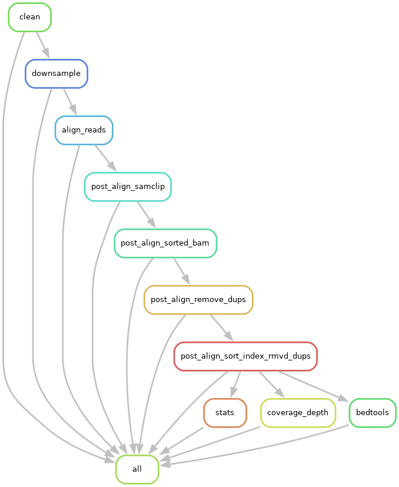

# SNPKIT

Snakemake workflow for Microbial Variant Calling, Recombination detection and Phylogenetic tree reconstruction.

## Installation

> Clone the github directory onto your system.

```
git clone https://github.com/Snitkin-Lab-Umich/snpkit-smk.git

```
> Create snpkit conda environment

```
conda env create -f snpkit.yaml -n snpkit
```

> Change snakemake configuration settings in config/config.yaml file and create a new sample list file - samples.tsv


## Quick start

### Run snpkit on a set of samples.

```
snakemake -s snpkit.smk -p --use-conda -j 999 --cluster "sbatch -A {cluster.account} -p {cluster.partition} -N {cluster.nodes}  -t {cluster.walltime} -c {cluster.procs} --mem-per-cpu {cluster.pmem}" --conda-frontend conda --cluster-config config/cluster.json --configfile config/config.yaml --latency-wait 1000
```



