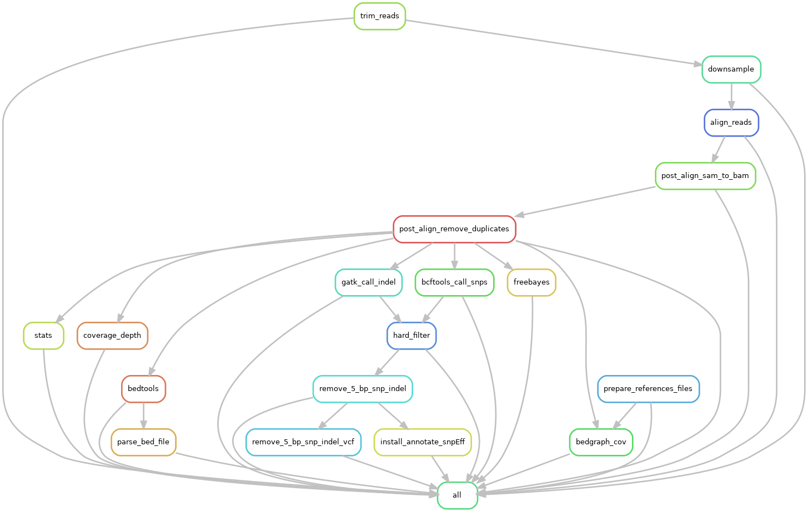

# SNPKIT

Snakemake workflow for Microbial Variant Calling, Recombination detection and Phylogenetic tree reconstruction.

## Installation

> Clone the github directory onto your system.

```
git clone https://github.com/Snitkin-Lab-Umich/snpkit-smk.git
```

## Customize the config.yaml according to your samples

Change snakemake configuration settings in config/config.yaml file and create a new sample list file in config/samples.tsv. For example, if sample is called *Rush_KPC_11_R1_trim_paired.fastq.gz*, only include the sample name, i.e. **Rush_KPC_11** in samples.tsv. 

### Create snpEff database

Before you run snpkit, it is essential to establish a snpEff database tailored to your reference genome. Refer to the documentation [here](snpEff.md) for detailed instructions on creating the database. 

> Load snakemake module from Great Lakes modules
```
module load snakemake
```

## Quick start

### Run snpkit on a set of samples.

```
snakemake -s snpkit.smk -p --use-conda -j 999 --cluster "sbatch -A {cluster.account} -p {cluster.partition} -N {cluster.nodes}  -t {cluster.walltime} -c {cluster.procs} --mem-per-cpu {cluster.pmem}" --conda-frontend conda --cluster-config config/cluster.json --configfile config/config.yaml --latency-wait 1000
```



